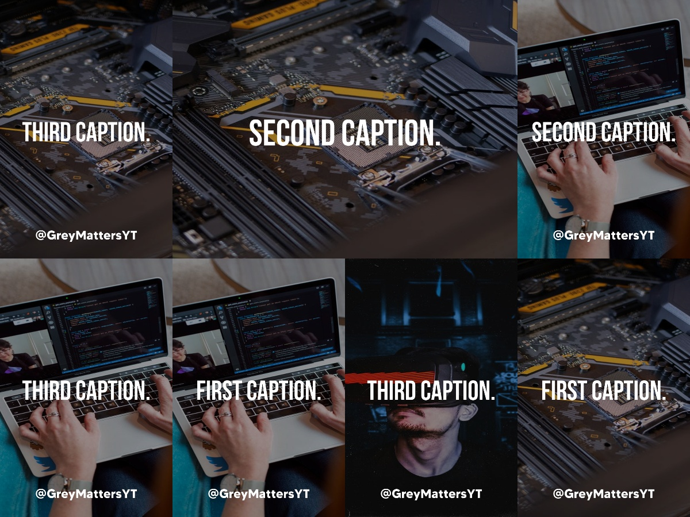

# Post-Generator-For-Instagram

[Tutorial Video]()

 This project's goal is to automate the process of overlaying text onto images. Images to be overlayed with text are to be stored in the ```/in/bkg``` directory. The lines of text are to be stored in a text file ```quotes.txt```.



## Getting Started

Clone:
```git clone https://github.com/Greymattersbot/Post-Generator-for-Instagram.git```

Run the script:
```python post_generator.py```

### Prerequisites

Python

## Built With

* Python Imaging Library (PIL)
* Python textwrap module
